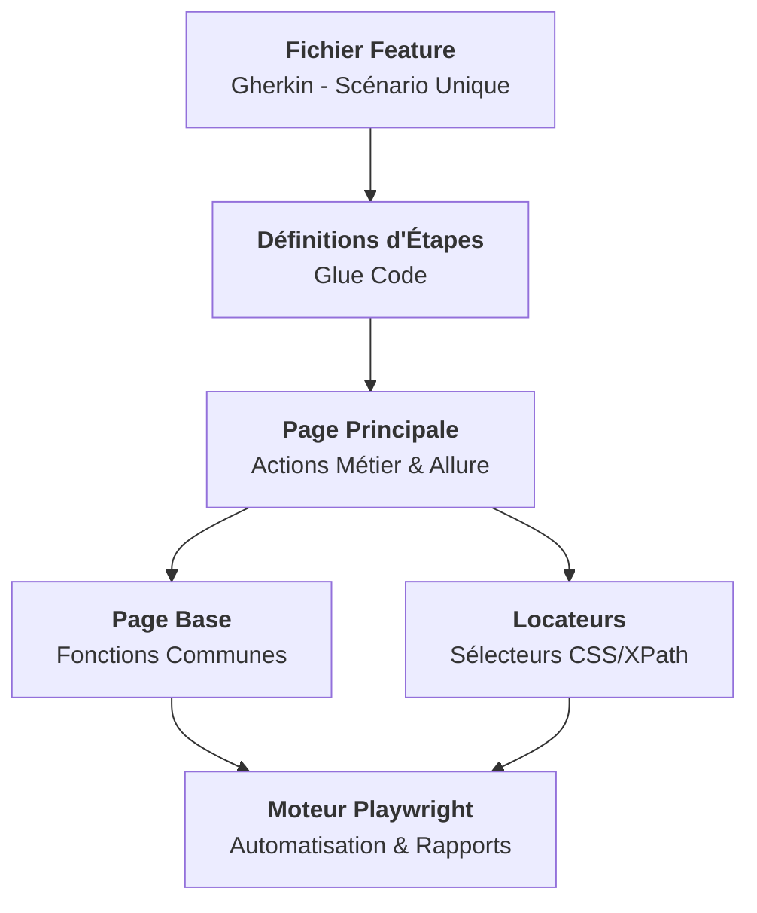

<div align="center">

# 🏦 Lombard Odier
### **Framework d'Automatisation E2E Excellence**

[](https://playwright.dev/)
[](https://cucumber.io/)
[](https://www.typescriptlang.org/)
[](https://nodejs.org/)
[](https://docs.qameta.io/allure/)
[](https://www.jenkins.io/)

> **Une solution de test End-to-End de qualité bancaire, robuste et évolutive, conçue spécifiquement pour l'écosystème numérique de Lombard Odier.**

[🚀 Installation](#-installation) • [▶️ Exécution](#-exécution-des-tests) • [📊 Rapports](#-rapports) • [🏗 Architecture](#-aperçu-de-larchitecture)

---
</div>

## 📋 Table des Matières

<details>
<summary><b>📖 Cliquez pour explorer</b></summary>

- [🏗 Aperçu de l'Architecture](#-aperçu-de-larchitecture)
- [📁 Structure du Projet](#-structure-du-projet)
- [🔧 Prérequis](#-prérequis)
- [📦 Installation](#-installation)
- [▶️ Exécution des Tests](#-exécution-des-tests)
- [📊 Rapports](#-rapports)
- [🔄 Intégration CI/CD](#-intégration-cicd)
- [⚙️ Configuration](#-configuration)
- [🎯 Patrons de Conception](#-patrons-de-conception)
</details>

---

## 🌟 Points Forts du Framework

| 🚀 Vitesse | 🛡️ Robustesse | 📊 Visibilité |
| :--- | :--- | :--- |
| Exécution parallèle et moteur Playwright ultra-rapide. | Mécanismes d'auto-attente et résilience aux changements. | Rapports Allure détaillés avec vidéo et captures. |

---

---

## 🏗 Aperçu de l'Architecture



> La structure suit une approche **modulaire et hiérarchique** pour garantir une maintenance facile et une lisibilité maximale.

---

## 📁 Structure du Projet

```
LO-GX Playwright_E2E/
├── 📄 Jenkinsfile                      # Pipeline CI/CD
├── 📄 cucumber.js                      # Configuration des profils Cucumber
├── 📄 playwright.config.ts             # Configuration Playwright
├── 📄 tsconfig.json                    # Configuration TypeScript
├── 📄 package.json                     # Dépendances & scripts npm
├── 📄 .env                             # Variables d'environnement
├── 📄 .env.staging                     # Surcharges staging
├── 📄 .env.production                  # Surcharges production
│
├── 📂 src/
│   ├── 📂 config/
│   │   ├── env.config.ts               # Chargeur de configuration
│   │   └── browser.config.ts           # Options de lancement navigateur
│   │
│   ├── 📂 locateurs/
│   │   └── LocateursPage.ts            # � Sélecteurs centralisés (unique)
│   │
│   ├── 📂 pages/
│   │   ├── PageBase.ts                 # 🔑 Fonctions communes (attente, clic...)
│   │   └── PagePrincipale.ts           # 🏦 Actions métier (unique)
│   │
│   ├── 📂 steps/
│   │   └── etapes.steps.ts             # 📝 Définitions d'étapes (unique)
│   │
│   ├── 📂 hooks/
│   │   └── hooks.ts                    # ⚙️ Cycle de vie (Before/After)
│   │
│   └── 📂 support/
│       └── monde.ts                    # 🌍 État partagé (navigateur/page)
│
├── 📂 tests/
│   └── 📂 features/
│       └── parcours-complet.feature    # 🧪 Scénario E2E unique (Gherkin)
│
└── 📂 reports/
    ├── 📂 allure-results/              # Données brutes Allure
    ├── 📂 allure-report/               # Rapport HTML Allure généré
    ├── 📂 screenshots/                 # Captures d'écran en cas d'échec
    └── 📂 videos/                      # Enregistrements vidéo
```

---

## 🔧 Prérequis

| Outil      | Version  | Utilisation                |
|------------|----------|----------------------------|
| Node.js    | ≥ 18.x   | Environnement d'exécution  |
| npm        | ≥ 9.x    | Gestionnaire de paquets    |
| Java JDK   | ≥ 11     | Serveur de rapports Allure |
| Git        | Dernière | Contrôle de version        |

---

## 📦 Installation

```bash
# 1. Cloner le dépôt
git clone <url-du-depot>
cd LO-GX\ Playwright_E2E

# 2. Installer les dépendances
npm install

# 3. Installer les navigateurs Playwright
npx playwright install --with-deps chromium

# 4. Vérifier l'installation
npx tsc --noEmit
```

---

## ▶️ Exécution des Tests

### Commande Principale (Recommandée) 🚀

C'est la commande la plus importante pour le développement local. Elle enchaîne le nettoyage, l'exécution des tests et l'ouverture automatique du rapport Allure.

```bash
npm run test:report
```

---

### Tests Cucumber (BDD)

```bash
# Exécuter tous les tests (sans ouverture auto du rapport)
npm test

# Exécuter par profil
npm run test:smoke          # 🔥 Tests smoke uniquement
npm run test:regression     # 🔄 Suite de régression complète
npm run test:critical       # 🚨 Tests du chemin critique
npm run test:e2e            # 🧪 Parcours E2E complet

# Exécuter en mode visible (navigateur ouvert)
npm run test:headed

# Exécuter en mode CI (headless)
npm run test:ci
```

### Tests Playwright Directs

```bash
npm run test:playwright           # Tous les navigateurs
npm run test:playwright:headed    # Navigateur visible
npm run test:playwright:ui        # Mode interactif UI
```

---

## 📊 Rapports

### Rapport Allure

```bash
# ⚠️ La commande suivante est recommandée car elle fait TOUT :
npm run test:report

# Générer et ouvrir le rapport Allure manuellement
npm run report:allure

# Générer uniquement
npm run report:generate

# Ouvrir un rapport existant
npm run report:open
```

### Rapport Cucumber HTML

```bash
npm run report:cucumber
```

### Pipeline complète (Test + Rapport)

```bash
npm run test:full              # Tous les tests + rapport Allure
npm run test:smoke:report      # Tests smoke + rapport Allure
npm run test:regression:report # Régression + rapport Allure
```

### Fonctionnalités du Rapport Allure

- ✅ Détails d'exécution étape par étape
- 📸 Captures d'écran automatiques en cas d'échec
- 🎬 Enregistrements vidéo attachés par scénario
- 📋 Informations d'environnement (navigateur, URL, OS)
- 📊 Graphiques de tendance et statistiques
- 🏷 Tags et labels de sévérité

---

## 🔄 Intégration CI/CD

### Pipeline Jenkins

Le `Jenkinsfile` fournit une pipeline CI/CD complète :

```
📥 Checkout → 📦 Installation → 🔍 Lint → 🧪 Tests (Headless) → 📊 Rapports
```

> **Note :** La pipeline est configurée pour s'exécuter automatiquement à chaque **commit** (via polling SCM) et utilise exclusivement le mode **Headless** pour une performance optimale sur le serveur.


**Paramètres de la pipeline :**

| Paramètre       | Options                              | Description              |
|-----------------|--------------------------------------|--------------------------|
| ENVIRONMENT     | staging, production, development     | Environnement cible      |
| BROWSER         | chromium, firefox, webkit            | Moteur de navigateur     |
| TEST_SUITE      | regression, smoke, critical, e2e     | Profil de test           |
| GENERATE_ALLURE | true / false                         | Générer le rapport Allure|

---

## ⚙️ Configuration

### Variables d'Environnement (`.env`)

| Variable                | Défaut                           | Description                      |
|-------------------------|----------------------------------|----------------------------------|
| `BASE_URL`              | https://www.lombardodier.com     | URL de base de l'application     |
| `BROWSER`               | chromium                         | Moteur de navigateur             |
| `HEADLESS`              | false                            | Exécution sans interface         |
| `SLOWMO`                | 500                              | Ralentissement (ms)              |
| `DEFAULT_TIMEOUT`       | 30000                            | Délai d'attente par défaut (ms)  |
| `RETRY_COUNT`           | 2                                | Nombre de tentatives             |
| `VIDEO_RECORDING`       | true                             | Activer l'enregistrement vidéo   |
| `SCREENSHOT_ON_FAILURE` | true                             | Capture en cas d'échec           |

### Support Multi-Environnement

```bash
# Exécuter sur staging
ENV=staging npm test

# Exécuter sur production (défaut)
ENV=production npm test
```

---

## 🎯 Patrons de Conception

### Page Object Model (POM)

```
Feature File → Définitions d'Étapes → PagePrincipale → LocateursPage
                                            ↓
                                     PageBase (fonctions communes)
```

1. **LocateursPage** — Sélecteurs centralisés dans `src/locateurs/`
2. **PageBase** — Méthodes utilitaires partagées dans `src/pages/`
3. **PagePrincipale** — Actions métier combinant locateurs + PageBase
4. **Étapes** — Code Cucumber propre, délègue aux Page Objects
5. **Hooks** — Gestion du cycle de vie (navigateur, capture, vidéo)

### Méthodes Clés de PageBase

| Méthode                   | Description                              |
|---------------------------|------------------------------------------|
| `attendreVisible()`       | Attendre qu'un élément soit visible      |
| `attendreCache()`         | Attendre qu'un élément soit caché        |
| `attendreAttache()`       | Attendre qu'un élément soit dans le DOM  |
| `attendreReseauInactif()` | Attendre la fin des requêtes réseau      |
| `cliquer()`               | Cliquer avec attente automatique         |
| `saisirTexte()`           | Effacer et remplir un champ              |
| `obtenirTexte()`          | Obtenir le texte d'un élément            |
| `verifierVisible()`       | Vérifier la visibilité d'un élément      |
| `verifierContientTexte()` | Vérifier qu'un élément contient un texte |
| `prendreCapture()`        | Capturer et attacher à Allure            |
| `accepterCookies()`       | Gérer le bandeau de cookies              |
| `defilerVersElement()`    | Faire défiler jusqu'à un élément         |

---

## 🧪 Scénario de Test

### Parcours E2E Complet (1 scénario unique et continu)

Le navigateur ne redémarre **jamais** entre les étapes — le test enchaîne :

1. 🏠 **Page d'accueil** — Chargement, vérification logo, menu, bouton connexion
2. 🍪 **Cookies** — Acceptation du bandeau
3. 🧭 **Navigation** — Ouverture/fermeture du menu principal
4. 📄 **Contenu** — Défilement, vérification des sections
5. 🦶 **Pied de page** — Liens, copyright, LinkedIn
6. ⬆️ **Retour en haut** — Vérification du logo
7. 🔐 **Connexion** — Navigation vers MyLO
8. 🏠 **Retour accueil** — Vérification finale
9. 📸 **Capture d'écran** — Documentation du parcours

---

## 📝 Licence

Usage interne uniquement — Lombard Odier Group
